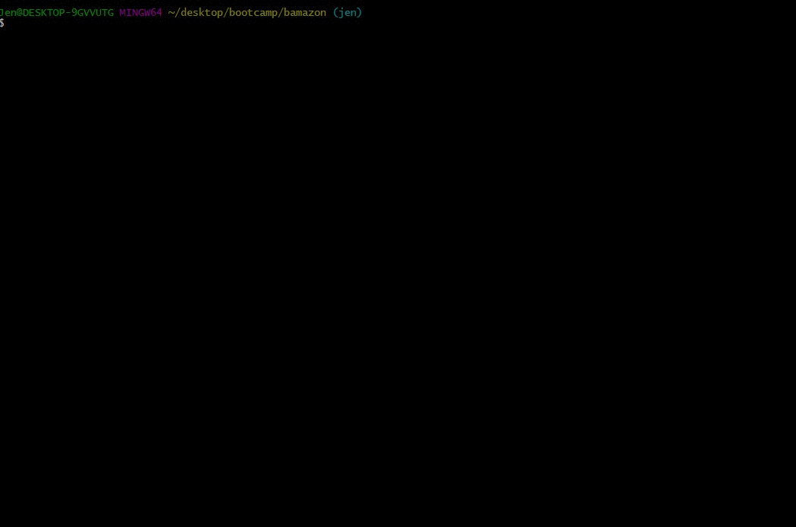

# Bamazon! (Hey--this was a homework assingment, I didn't make up the name.)

## Summary:
This is a shopping app mockup to show you how a simple SQL server and a basic node application can provide all the components you need to enter and track shopping online. It uses the following basic NPM packages: 
* console.table
* inquirer
* mysql
* table

NOTE--The code in the sql file must be installed independently, using something like mySQL Workbench (which is what this programmer used). 

## How to use:
The customer enters the program from the program folder in the command line (after installing the NPM packages with --npm install) by typing in "node bamazonCustomer.js" 

Then the customer is prompeted if they want to shop or exit. Customer chooses and is presented with a list of items. Customer chooses an item and is prompted for quantity. Customer chooses quantity and is provided with their selection and a total cost (including sales tax if they are from NJ--we have to follow state law, after all!) The server is updated to reflect the remaining quantities.

Here is a demo of someone going through all the different options. You will note that a quantity in excess of the amount in stock requires the customer to re-select, as does an invalid number. Customer, after each transaction, is given the option to exit. 

## Demo:
